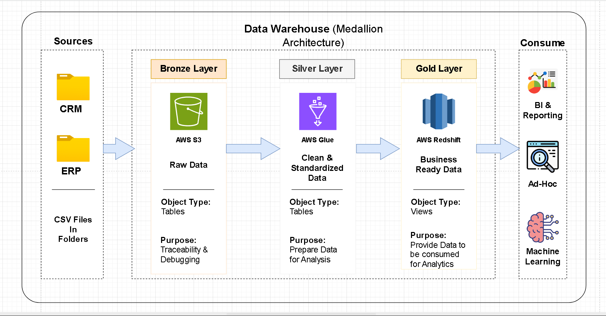

# Data Warehouse Project

Welcome to the **Data Warehouse Project** repository! 🚀  
This project demonstrates a comprehensive data warehousing and analytics solution, from building a data warehouse to generating actionable insights.

---
## 🏗️ Data Architecture

The data architecture for this project follows Medallion Architecture **Bronze**, **Silver**, and **Gold** layers:


1. **Bronze Layer**  
   - Ingests raw data from source systems (CSV files).
   - Data is parsed, validated (schema & completeness), and loaded as-is into SQL Server.
   - Full Load strategy via *truncate and insert*.

2. **Silver Layer**  
   - Cleanses and transforms data (deduplication, data type checks, string trimming, etc.).
   - Introduces **meta columns** (e.g., `create_date`, `update_date`, `source_system`).
   - Resolves data quality issues and enforces integrity constraints.

3. **Gold Layer**  
   - Integrates refined data into a **star schema**: fact and dimension tables.
   - Business-friendly naming, enriched columns, and optimized for BI tools and reporting.
   - Ensures integration consistency and data correctness.
     
---
## 📖 Project Overview

This project involves:

1. **Data Architecture**: Designing a Modern Data Warehouse Using Medallion Architecture **Bronze**, **Silver**, and **Gold** layers.
2. **ETL Pipelines**: Extracting, transforming, and loading data from source systems into the warehouse.
3. **Data Modeling**: Developing fact and dimension tables optimized for analytical queries.


## 📌 Project Objectives

### 🛠️ Data Engineering

- Design and implement a modern data warehouse using **SQL Server**.
- Consolidate data from **ERP** and **CRM** source systems.
- Ensure data quality, integrity, and usability for downstream reporting and analysis.

---

## 🔄 ETL Workflow

### 🔽 Extraction
- **Type**: Full Extraction  
- **Technique**: File Parsing (CSV)  
- Extract data from:
  - ERP system
  - CRM system

### ⬆️ Load
- **Method**: Full Load using *truncate & insert*  
- **Storage**: SQL Server database

### 🔄 Transformation
- **SCD Type**: Type 1 (overwrite)
- **Data Quality Checks**:
  - Duplicates
  - Data type mismatches
  - Invalid business logic
  - Null or invalid values
  - Date inconsistencies

---

## ⭐ Star Schema (Gold Layer)

- **Fact Tables**: Capture measurable events (e.g., sales, transactions)
- **Dimension Tables**: Store descriptive attributes (e.g., customers, products)
- Use of **Surrogate Keys** for simplified joins and performance optimization

---

### Specifications
- **Data Sources**: Import data from two source systems (ERP and CRM) provided as CSV files.
- **Data Quality**: Cleanse and resolve data quality issues prior to analysis.
- **Integration**: Combine both sources into a single, user-friendly data model designed for analytical queries.
- **Scope**: Focus on the latest dataset only; historization of data is not required.
- **Documentation**: Provide clear documentation of the data model to support both business stakeholders and analytics teams.

---

## 📂 Repository Structure
```
sql-portfolio-data-warehouse/
│
├── datasets/                           # Raw datasets used for the project (ERP and CRM data)
│
├── docs/                               # Project documentation and architecture details
│   ├── data_architecture               # Draw.io file shows the project's architecture
│   ├── data_integration                # Draw.io file for the data integration diagram
│   ├── data_model                      # Draw.io file for data models (star schema)
│
├── scripts/                            # SQL scripts for ETL and transformations
│   ├── bronze/                         # Scripts for extracting and loading raw data
│   ├── silver/                         # Scripts for cleaning and transforming data
│   ├── gold/                           # Scripts for creating analytical models
│
├── tests/                              # Test scripts and quality files
│
├── README.md                           # Project overview and instructions
├── LICENSE                             # License information for the repository
├── .gitignore                          # Files and directories to be ignored by Git
```
---


## 🛡️ License

This project is licensed under the [MIT License](LICENSE). You are free to use, modify, and share this project with proper attribution.

## 🌟 About Me

Hi there! I'm **Yash Kamath**. I am a Third-year Engineering student specializing in Artificial Intelligence and Data Science with a strong passion for transforming data into actionable insights. My expertise spans developing dashboards, reports, and data models that drive business performance. I enjoy mapping business requirements to technical solutions and strive to make complex information meaningful and impactful through compelling data stories.

Let's stay in touch! Feel free to connect with me:


[](https://www.linkedin.com/in/yash-kamath1406/)
[](https://yashkamath.notion.site/Data-Portfolio-156ea233881c804d83fdf00948968527)

